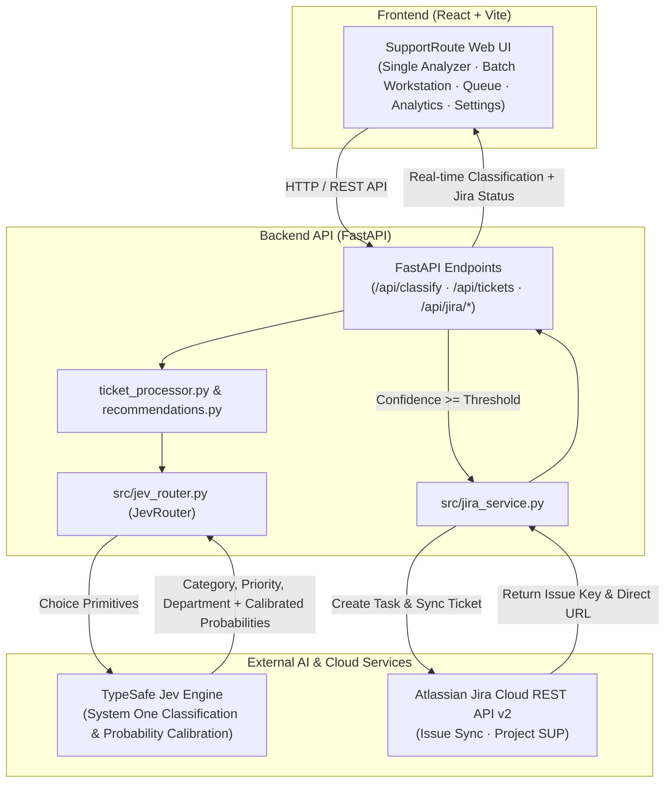

# AI Customer Support Ticket Router (Powered by Jev)

An intelligent customer support ticket classification and decision routing engine built with **FastAPI** and **React**, powered by **TypeSafe System One (Jev)** and integrated with **Atlassian Jira Cloud**.

The router accepts customer support messages and utilizes Jev's fast semantic judgment engine to simultaneously predict:
1. **Ticket Category** (with calibrated probability)
2. **Priority Level** (with calibrated probability)
3. **Assigned Department** (with calibrated probability)

It provides automated operational recommendations and flags ambiguous or low-confidence tickets for manual human review.

---

## 🎯 Project Objective

Modern customer support queues often suffer from:
- Slow, manual triage leading to SLA breaches.
- High token costs and latency from traditional generative LLMs.
- Fragile string parsing and JSON-schema hallucination in conversational models.
- Lack of calibrated confidence scores to know when an automated routing decision should be trusted.

This project demonstrates how **TypeSafe Jev** functions as a lightweight, lightning-fast **System One decision engine** that turns customer inquiries directly into typed routing judgments and true probability distributions.

---

## ⚡ Why Jev?

Unlike bulky generative LLMs that generate arbitrary prose or require slow prompt-and-parse loops:
- **Fast, Focused Judgments**: Jev is purpose-built for fast System One decision tasks.
- **Calibrated Probabilities**: Jev returns genuine probabilities across all candidate choices rather than arbitrary hallucinated percentages.
- **Typed Outputs**: Direct `Choice` primitives guarantee reliable categorical outputs without brittle regex or JSON parsing.
- **Single-Round Parallel Evaluation**: State and multiple independent questions (Category, Priority, Department) are evaluated concurrently in a single API call.
- **Predictable Cost & Latency**: Drastically smaller token footprint and minimal response overhead compared to generative LLMs.

---

## 📊 How Jev Probabilities Are Used

Jev computes exact probability distributions across candidate choices:
- **Visual Progress & ASCII Bars**: Every prediction displays its confidence percentage and visual block bars:
  ```text
  Payment Issue   ██████████████████░░ 91%
  Delivery Issue  ████████████████░░░░ 82%
  Technical Issue ████████████░░░░░░░░ 63%
  ```
- **Configurable Confidence Threshold**: A configurable threshold (default `70%`) evaluates whether predictions are safe for automated dispatch.
- **Automated Human-in-the-Loop Flagging**: If the model's confidence for any critical dimension falls below the threshold, the application immediately flags:
  > `⚠️ Low confidence — manual review recommended.`
  The system never invents fake categories or forced guesses.

---

## 🗂️ Core Taxonomies

### 1. Categories (9 Core Classes)
| Category | Scope & Criteria |
| :--- | :--- |
| **Payment Issue** | Unauthorized charges, failed transactions, double debits, card payment errors, payment deducted without order. |
| **Order Issue** | Order placement errors, incorrect quantities, missing items from box, order status updates. |
| **Delivery Issue** | Package delays, courier tracking not updating, lost packages, delivery to wrong address. |
| **Refund Request** | Customer asking for money back, refund status check, return for reimbursement. |
| **Product Issue** | Defective, broken, damaged products, wrong size/color received, quality issues. |
| **Account Issue** | Login failures, password resets, locked accounts, 2FA SMS code issues, profile settings. |
| **Technical Issue** | Mobile app crashes, website bugs, HTTP 500 errors, unresponsive buttons, glitches. |
| **Cancellation Request** | Customer requesting to cancel order, stop subscription, or halt dispatch prior to shipping. |
| **Other** | General feedback, compliments, partnership inquiries, or unlisted questions. |

### 2. Priorities (4 Levels)
- **Low**: Minor inquiries, general questions, non-time-sensitive issues.
- **Medium**: Standard requests requiring normal turnaround.
- **High**: Urgent disruption (e.g., payment deducted without order, overdue delivery, defective item).
- **Urgent**: Critical emergencies, severe financial discrepancies, total service outage.

### 3. Departments (7 Operational Queues)
- **Billing**: Payment processing, invoice disputes, duplicate charges, payment gateway issues.
- **Orders**: Order status, modifications, missing items, fulfillment.
- **Delivery**: Courier dispatch, package tracking, shipping delays, logistics.
- **Returns & Refunds**: Return authorizations, exchanges, refund disbursement.
- **Technical Support**: Application bugs, error codes, crash logs, IT assistance.
- **Account Support**: Credential recovery, authentication, 2FA, account security.
- **General Support**: General inquiries, policy explanations, feedback triage.

---

## 🏗️ Architecture



---

## 📁 Project Structure

```text
ai-ticket-router/
│
├── frontend/                   # Modern React + Vite Single Page Application
│   ├── src/
│   │   ├── App.jsx             # SupportRoute UI (Workstations, Live Jira cards, Analytics, Settings)
│   │   ├── main.jsx            # React root mount
│   │   └── index.css           # Styling & design system tokens
│   ├── package.json            # Frontend dependencies (React 19, Lucide icons, Vite)
│   └── vite.config.js          # Vite build config with backend API proxy
│
├── server.py                   # High-performance FastAPI backend REST API
│
├── src/                        # Core Python Intelligence & Routing Services
│   ├── __init__.py
│   ├── jev_router.py           # Isolated TypeSafe Jev System One decision engine
│   ├── ticket_processor.py     # Single & batch evaluation pipeline
│   ├── jira_service.py         # Atlassian Jira Cloud REST API v2 integration
│   ├── probability.py          # Probability formatting, thresholding, ASCII bars
│   ├── recommendations.py      # Automated business action & guidance engine
│   └── utils.py                # CSV validation, metrics calculation, data export
│
├── tests/                      # Automated Test Suite (29 Pytest Cases)
│   ├── test_jira_service.py    # Jira Cloud API integration & mock tests
│   ├── test_router.py          # Jev router tests & live API validation
│   ├── test_probability.py     # Probability helper & threshold tests
│   ├── test_recommendations.py # Recommendation rule tests
│   └── test_ticket_processor.py# Pipeline & batch processing tests
│
├── data/
│   └── sample_tickets.csv      # 110 realistic evaluation tickets across all categories
│
├── requirements.txt            # Python dependencies (FastAPI, uvicorn, typesafe-sdk, requests, etc.)
├── .env.example                # Sanitized environment template for Jev & Jira
└── README.md                   # Complete system documentation
```

---

## 🚀 Installation & Setup

### 1. Prerequisites
- Python 3.10+ installed.

### 2. Install Dependencies
```bash
pip install -r requirements.txt
```

### 3. Jev API Configuration
Set the Jev / TypeSafe API key in your environment:

**PowerShell (Windows):**
```powershell
$env:TYPESAFE_API_KEY="your_typesafe_api_key_here"
```

**Bash / macOS / Linux:**
```bash
export TYPESAFE_API_KEY="your_typesafe_api_key_here"
```

*(Note: `JEV_API_KEY` is also supported as an alias. If already configured in your environment, no action is needed.)*

---

## 🖥️ Running the Application
 
1. **Start the FastAPI Backend Server**:
```bash
python -m uvicorn server:app --port 8000 --reload
```

2. **Launch the React + Vite Frontend**:
```bash
cd frontend
npm install
npm run dev
```

Open your browser at `http://localhost:5173`.

### Application Interface:

1. **Single Ticket Analysis**:
   - Paste any customer support message or choose from quick sample presets.
   - Click **Analyze Ticket** to inspect predicted Category, Priority, Department, calibrated probabilities, ASCII visualization bars, and recommended actions.
   - Low confidence predictions (< 70% threshold) are clearly highlighted.

2. **Batch Analysis**:
   - Upload any CSV containing `ticket_id` and `ticket` columns, or click **Load Sample Dataset (110 Tickets)**.
   - Run batch classification with real-time progress indicators.
   - View results in a clean table and download the output as CSV.

---

## 🔗 Phase 2: Jira Cloud Integration

SupportRoute seamlessly synchronizes real AI classifications directly into **Atlassian Jira Cloud**:
- **Automatic Issue Creation**: When classification confidence meets the configured threshold ($\ge 70\%$), a native Jira Task is automatically created in the configured project (e.g. `SUP`) with customer context, intent, priority, and recommended actions.
- **Confidence Gate & Manual Review**: Low-confidence predictions are safely held for human triage, with manual "Create in Jira" and "Retry" options.
- **Direct Deep Links**: Displays real Jira issue keys (`SUP-104`) with clickable `[Open in Jira →]` links in both the Single Ticket Analyzer and Ticket Queue table.
- **Settings & Connectivity Test**: Built-in integration dashboard in Settings with live connection status indicators and on-demand handshake verification.

### Jira Configuration
Set the following variables in `.env`:
```env
JIRA_URL=https://your-domain.atlassian.net
JIRA_EMAIL=your_email@example.com
JIRA_API_TOKEN=your_jira_api_token
JIRA_PROJECT_KEY=SUP
```

---

## 🧪 Running Tests

Run the full automated test suite with pytest:
```bash
python -m pytest -v
```
All 29 test cases cover live API calls, input validation, probability calculations, CSV handling, recommendation rules, and Jira Cloud integration.
